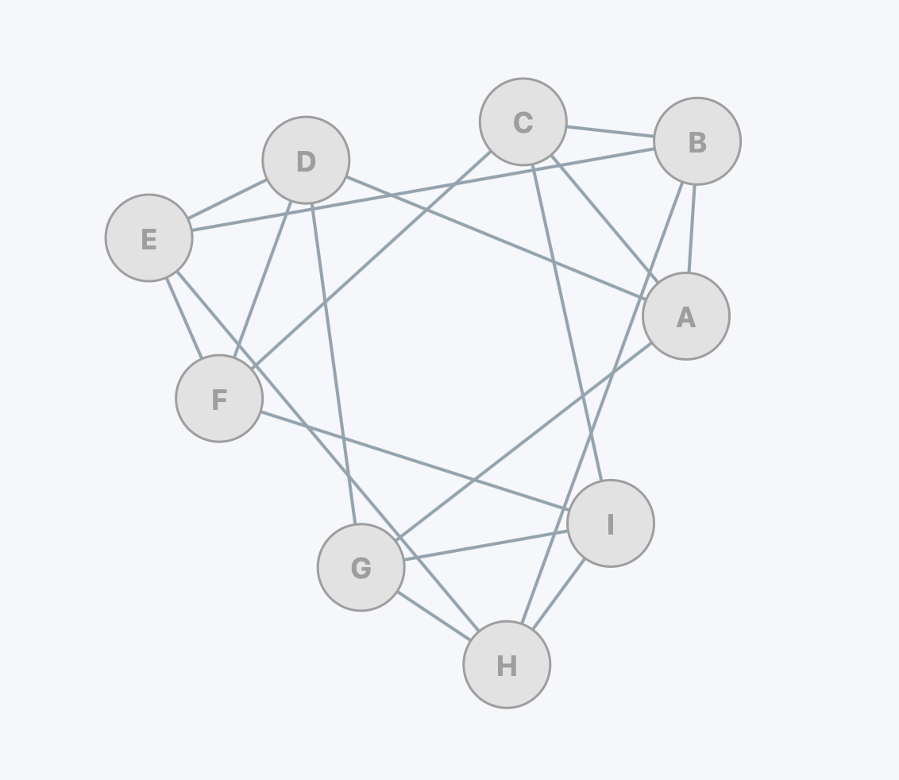
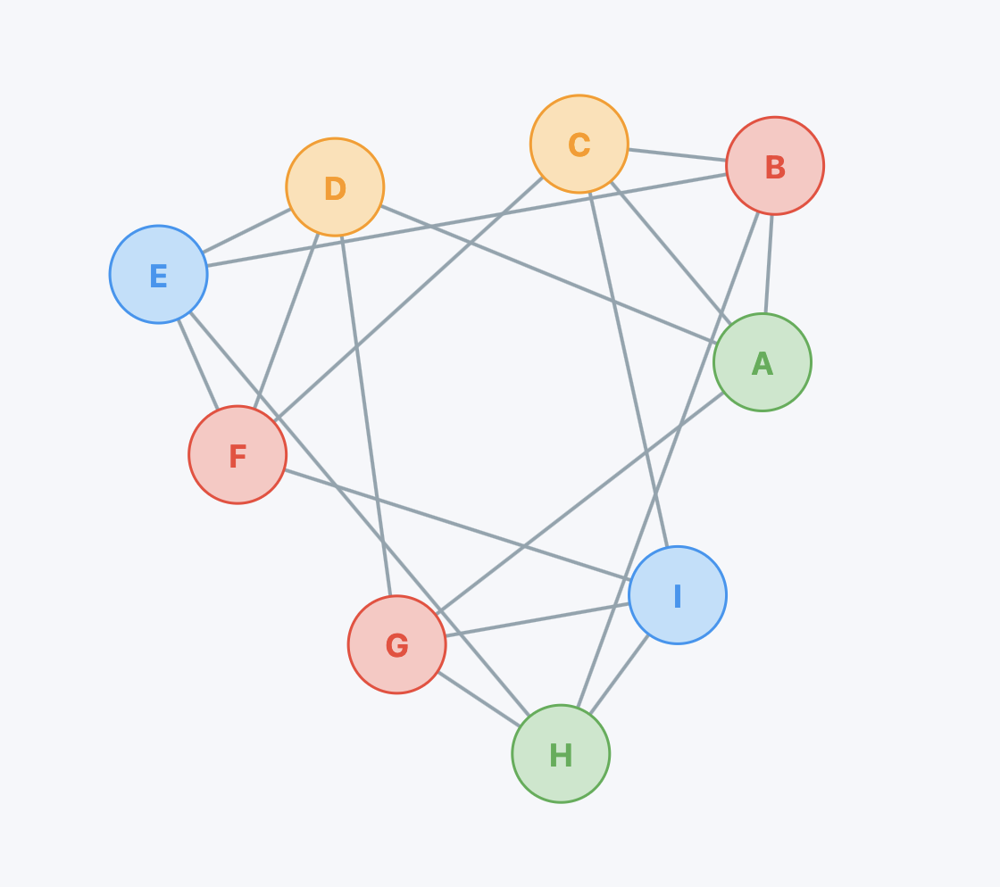

## Problema

Una coordinación académica debe asignar bloques de tiempo (2 horas por bloque) a un conjunto de clases, evitando traslapes que violen las siguientes restricciones operativas:

- Un grupo no puede cursar dos clases en el mismo bloque de tiempo.
- Un docente no puede impartir dos clases en el mismo bloque de tiempo.

## Objetivo general

Optimizar la asignación de bloques de tiempo para clases académicas mediante el modelado del problema como un grafo de conflictos y la aplicación de algoritmos de coloreo.

## Tareas para realizar

- Modelar el conjunto de clases como un grafo de conflictos a partir de restricciones por grupo y por docente (como ejemplo considere los datos de la Tabla 1).
- Construir la representación gráfica del grafo para su procesamiento.
- Aplicar un algoritmo Greedy (paso a paso), dibujando el grafo de conflictos generado considerando el conjunto de datos de la Tabla 1 con el orden: B, A, H, F, I, E, D, C, G.
- Aplicar cualquier otro algoritmo de coloreo de grafos para compararlo con el algoritmo Greedy, considere los mismos datos de la Tabla 1 y coloree el grafo resultante.
- Argumentar un resultado teórico que le permita determinar: ¿cuándo se obtiene un número mínimo de bloques de tiempo?, o ¿cómo saber que ya no se puede reducir el número de bloques de tiempo.?
- Realizar el análisis de la complejidad de los algoritmos de coloreo utilizados.
- Proponer una implementación computacional para al menos uno de los algoritmos propuestos para el caso general de resolver conflictos mediante el coloreo grafos.

Tabla 1.  Regla de conflicto: dos clases están en conflicto si comparten el mismo Grupo o Docente.

| Id_Clase | Materia    | Grupo | Docente |
| --- | --- | --- | --- |
| A | Mate I     | G1 | T1 |
| B | Mate II    | G1 | T2 |
| C | Mate III   | G1 | T3 |
| D | Física I   | G2 | T1 |
| E | Física II  | G2 | T2 |
| F | Física III | G2 | T3 |
| G | Prog I     | G3 | T1 |
| H | Prog II    | G3 | T2 |
| I | Prog III   | G3 | T3 |

### Preguntas guía

- ¿Cómo se construye el grafo de conflictos a partir de datos de clases?
- ¿Cuál es el número mínimo de bloques requerido para un conjunto de clases dado?
- ¿Qué algoritmo de coloreo produce soluciones de mejor calidad (menos bloques) bajo el mismo tiempo de cómputo?
- ¿Cómo se valida que el horario resultante no contiene conflictos?
- ¿En una implementación computacional que estructura de datos es adecuada para representar los datos del grafo de conflictos?
- Cómo se quiere obtener un óptimo minimal sobre el número de bloques de tiempo, ¿cómo saber si ya obtuvo tal valor óptimo?
- ¿Cómo cambia la solución al introducir el conflicto sobre la disponibilidad de los docentes por bloque?

#### Por ejemplo

Disponibilidad por docente:

- T1: **NO disponible** en B1 y B4 → **permitidos** {B2, B3}
- T2: **NO disponible** en B2 y B3 → **permitidos** {B1, B4}
- T3: **NO disponible** en B1 y B3 → **permitidos** {B2, B4}

---

## Solucion

### Tarea 1

Modelar el conjunto de clases como un grafo de conflictos a partir de restricciones por grupo y por docente (como ejemplo considere los datos de la Tabla 1).

#### Ejecución

Al analizar el problema, podemos encontrar similitudes con **Graph Coloring**. Dado que este último es un problema **NP-Completo**, es conveniente reducir nuestro problema a este. Esto nos permite obtener información relevante sobre su complejidad:

- El hecho de que sea **NP** indica que existe una forma de **verificar rápidamente una solución candidata** en tiempo polinomial.
- Al ser **NP-Hard**, no se conoce un algoritmo eficiente que garantice una solución exacta. Por ello, resulta recomendable usar **heurísticas** como **Greedy**, **DSATUR** o **Backtracking**, considerando su costo computacional.

#### Demostración

Comenzamos demostrando que **Graph Coloring** es en efecto un **NP-Hard**:

#### Ejemplo visual

Consideremos la fórmula **3-SAT** pequeña:

`phi = (x_1 u - x_2 u x_2) ^ (- x_1 u x_2 u x_1)`

**Paso 1: Triángulo base**

```
B (BASE)
 /   \
T     F
```

- T = TRUE
- F = FALSE
- B = BASE

**Paso 2: Nodos de variables**

- Variable \(x_1\): nodos \(x_1\) y \(- x_1\) conectados entre sí y a B
- Variable \(x_2\): nodos \(x_2\) y \(- x_2\) conectados entre sí y a B

```
     x1 --- -x1
      \     /
       \   /
         B
     x2 --- -x2
      \     /
       \   /
         B
```

**Paso 3: Nodos de cláusulas**

- Cláusula \(C_1 = (x_1 u - x_2 u x_2)\)
- Cláusula \(C_2 = (- x_1 u x_2 u x_1)\)

- Cada nodo de cláusula conectado a su literal correspondiente y al nodo BASE B

```
C1 nodes: c11, c12, c13
c11 -- x1
c12 -- -x2
c13 -- x2
c11,c12,c13 -- B (triángulo)

C2 nodes: c21, c22, c23
c21 -- -x1
c22 -- x2
c23 -- x1
c21,c22,c23 -- B (triángulo)
```

**Interpretación:**

- Para que los triángulos de cláusulas sean 3-coloreables, **al menos un literal debe ser TRUE**.
- Esto asegura que la asignación de colores corresponde a una **solución satisfacible** de la fórmula 3-SAT.

```
TRUE  = T
FALSE = F
BASE  = B
```

- Asignando colores a los nodos de variables según una solución válida, podemos colorear todos los triángulos de cláusulas, demostrando la correspondencia con **3-SAT**.

Por lo tanto, **Graph Coloring** con k ≥ 3 colores es **NP-Hard**, y como verificar un coloreo dado se hace en tiempo polinomial, también es **NP-Completo**.

#### Reducción a **Graph Coloring**

Luego de esta demostración, reducimos nuestro problema de asignación de bloques de clases a **Graph Coloring** de la siguiente manera:

- Cada clase se representa como un nodo en el grafo.
- Se dibuja una arista de conflicto entre dos nodos si las clases comparten el **mismo grupo** o el **mismo docente**, asi reflejamos que no pueden ocurrir en el **mismo bloque de tiempo**.
- Colorear el grafo con **k** colores equivale a asignar a **k** bloques de tiempo de manera que no existan conflictos, cumpliendo así todas las restricciones.

Eesta reducción permite aplicar algoritmos de coloreo de grafos como **Greedy**, **DSATUR** y **Backtraking** para obtener horarios válidos.

De esta forma, se ha resuelto la primera tarea planteada en nuestro Objetivo.

### Tarea 2

Construir la representación gráfica del grafo para su procesamiento.

#### Ejecución



### Tarea 3
Aplicar un algoritmo Greedy (paso a paso), dibujando el grafo de conflictos generado considerando el conjunto de datos de la Tabla 1 con el orden: B, A, H, F, I, E, D, C, G.

#### Ejecución

Orden de visita solicitado:

`B, A, H, F, I, E, D, C, G`

Grafo de conflicto por listas de adyacencia:

```
A -> B, C, D, G
B -> A, C, E, H
C -> A, B, F, I
D -> A, E, F, G
E -> B, D, F, H
F -> C, D, E, I
G -> A, D, H, I
H -> B, E, G, I
I -> C, F, G, H
```

Pasos del algoritmo de coloreo:

| Nodo | Colores de vecinos | Color asignado |
| --- | --- | --- |
| B | [] | 0 |
| A | [0] | 1 |
| H | [0] | 1 |
| F | [] | 0 |
| I | [0, 1] | 2 |
| E | [0, 1] | 2 |
| D | [0, 1, 2] | 3 |
| C | [0, 1, 2] | 3 |
| G | [1, 2, 3] | 0 |

Coloración final:

```
{
  B: 0,
  A: 1,
  H: 1,
  F: 0,
  I: 2,
  E: 2,
  D: 3,
  C: 3,
  G: 0
}
```


